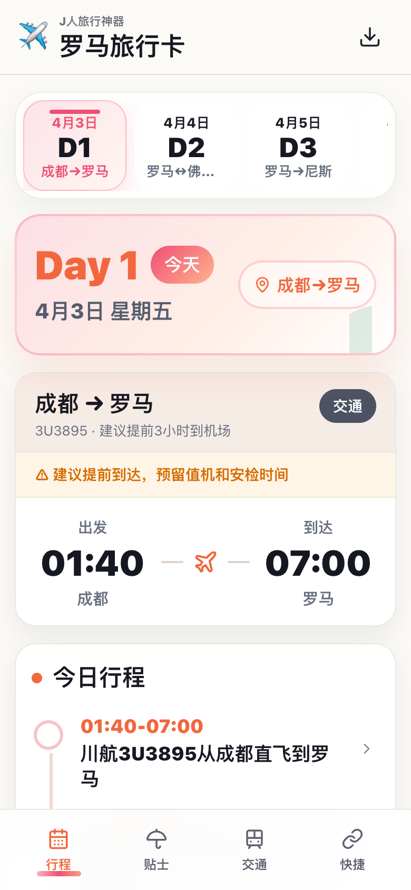
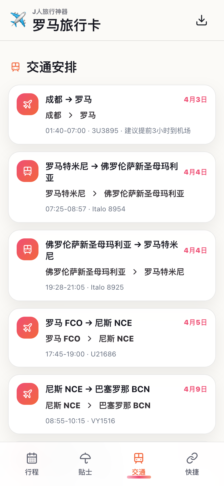
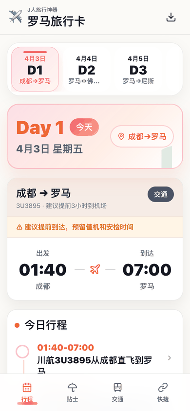
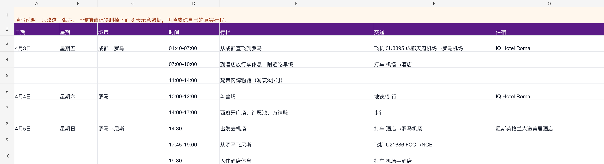

# J人旅行神器

专为 J 人设计的旅行工具：把笨重的桌面表格，转成适合手机户外阅读的轻量旅行 app。

## 项目背景与灵感

我自己就是一个很典型的 J 人。

作为一个计划型人格，规划一场旅行的乐趣往往有一半来自出发前。我会在电脑前打开 Excel、飞书或腾讯文档，把交通衔接、每日路线、酒店信息、想去的地方和各种备注整理得井井有条。看着格子里满满当当的结构化数据，安全感爆棚。

然而，计划的浪漫主义，往往在双脚踏上陌生城市街头的那一刻戛然而止。

想象一下：你站在机场、地铁口或酒店前台，左手拉着行李，右手拿着手机，在烈日、排队和不稳定的网络里，被迫去双指放大那张巨大表格。为了看一眼下一站在哪、几点出发、住哪家酒店，你要不断横向滑动、纵向滚动，还很容易看错行。

Excel 是桌面端做旅行规划的好工具，但它不是一个适合在路上反复打开的手机界面。

J人旅行神器正是为了解决这段“最后一公里”的痛点而生。它不试图改变你重度规划的习惯，而是把你出发前整理好的表格，转换成一个中文移动端旅行 app：手机打开链接后可以添加到主屏幕，像独立 app 一样随时查看今天要干啥、怎么走、住哪里、有哪些常用入口。

## 核心理念

这个项目想做的是把“出发前规划”和“旅途中查看”分开。

出发前，你依然可以在电脑上用表格整理行程，把日期、城市、时间、交通、住宿和备注写清楚。

旅途中，你不再打开一张密密麻麻的大表，而是打开一个适合手机阅读的随身旅行 app：今天在哪、现在要去哪、交通怎么安排、晚上住哪里、常用链接在哪里。

它不是复杂的行程管理系统，更像是给 J 人每次出门时临时生成的随身 app：一趟旅行一个，用完放着，不需要长期维护。

## 主要特性

- 一张 Excel 模板驱动：只保留一个 `行程` sheet，一张表，降低填写压力。
- 中文移动端体验：生成结果优先适配手机阅读，适合旅行途中快速查看。
- 行程、贴士、交通、快捷入口：把每天要做的事、交通安排和常用链接拆成更好看的页面。
- 可添加到主屏幕：发布后用手机浏览器打开链接，可以添加到桌面，像独立 app 一样使用。
- 支持离线查看：首次打开成功后，会缓存旅行 app；旅途中网络不稳时也能打开已加载内容。
- GitHub Pages 公网链接：最终交付的是可分享、可打开的网页链接，不是本地预览地址。

## 长什么样

| 行程 | 交通 | 快捷 |
| --- | --- | --- |
|  |  |  |



## 模板下载

模板只有一个 `行程` sheet，一张表。GitHub 不会直接预览 `.xlsx` 内容，点仓库里的文件页只会看到 `View raw`，这是正常的。

[直接下载 J人旅行神器模板](https://github.com/Iceeeeeeey/j-travel-toolkit/raw/main/skills/j-travel-toolkit/assets/j-travel-template.xlsx)

模板预览：



模板字段：

| 日期 | 星期 | 城市 | 时间 | 行程 | 交通 | 住宿 |
| --- | --- | --- | --- | --- | --- | --- |

模板里有 3 天左右示意数据。上传前记得删掉示意数据，再填自己的真实行程。

## 安装

### Codex

在 Codex 里安装这个 GitHub skill：

```bash
python3 ~/.codex/skills/.system/skill-installer/scripts/install-skill-from-github.py \
  --repo Iceeeeeeey/j-travel-toolkit \
  --path skills/j-travel-toolkit
```

安装后重启 Codex 或开一个新会话，然后说：

```text
使用 J人旅行神器，帮我生成旅行计划 app。
```

### Claude Code

把 `skills/j-travel-toolkit` 复制到 Claude Code 的 skills 目录，例如：

```text
~/.claude/skills/j-travel-toolkit
```

然后说：

```text
使用 J人旅行神器，帮我生成旅行计划 app。
```

## 使用流程

1. 说：`使用 J人旅行神器，帮我生成旅行计划 app。`
2. Skill 会先给你一份固定模板。
3. 按模板填写核心行程。
4. 上传填好的 Excel。
5. AI 补齐贴士和常用链接。
6. Skill 生成 app。
7. 按提示在 GitHub 新建一个空的 Public 仓库，把仓库 URL 发给 AI。
8. Skill 发布到 GitHub Pages。
9. 手机打开公开链接，添加到主屏幕。

## 发布到 GitHub

发布公网链接需要一个空的 GitHub 公开仓库。最简单的方式：

1. 打开 [https://github.com/new](https://github.com/new)。
2. Repository name 填一个旅行名，比如 `rome-trip-2026`。
3. 选择 `Public`。
4. 不要勾选 README、`.gitignore` 或 license。
5. 点击 `Create repository`。
6. 把仓库 URL 发给 AI，例如：

```text
https://github.com/<你的用户名>/<仓库名>.git
```

最终链接类似：

```text
https://<github-user>.github.io/<trip-repo>/
```

## 隐私提醒

GitHub Pages 默认是公开网页。不要把护照号、证件号、订单号、详细房号、紧急联系人手机号、支付信息等敏感内容写进模板。

## 本地开发

```bash
npm run sample
npm run build:sample
```

Skill 生成器入口：

```bash
node skills/j-travel-toolkit/scripts/j-travel-toolkit.mjs create --excel trip.xlsx --out ./my-trip-app
node skills/j-travel-toolkit/scripts/j-travel-toolkit.mjs publish --site ./my-trip-app --repo-url https://github.com/<user>/<repo>.git
```
